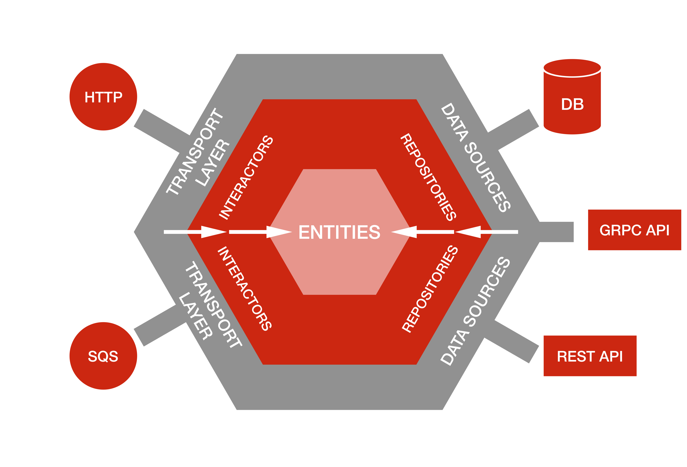
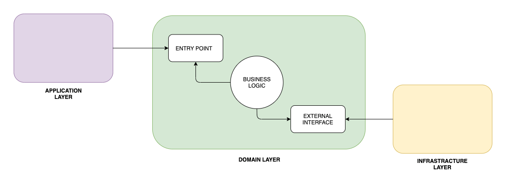
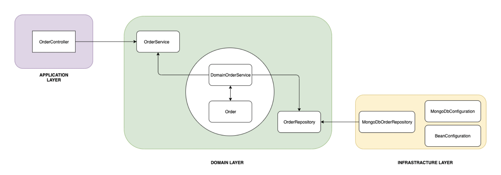

# Hexagonal architecture

The hexagonal architecture, or ports and adapters architecture, 
is an architectural pattern used in software design. 
It aims at creating loosely coupled application components that 
can be easily connected to their software environment 
by means of ports and adapters.

## References

- https://en.wikipedia.org/wiki/Hexagonal_architecture_(software)
- https://en.wikipedia.org/wiki/Java_package
- https://www.archunit.org/userguide/html/000_Index.html#_layered_architecture
- https://github.com/TNG/ArchUnit/issues/89
- https://www.baeldung.com/hexagonal-architecture-ddd-spring
- https://reflectoring.io/spring-hexagonal/
