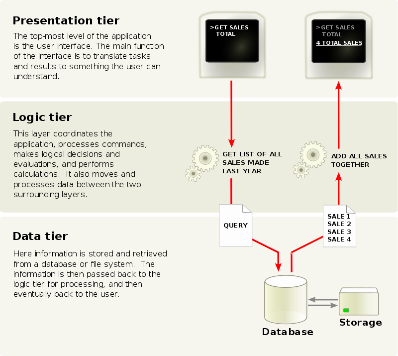

# Layered architecture

In software engineering, multitier architecture (often referred to as n-tier architecture) 
or multilayer architecture is a client–server architecture in which 
presentation, application processing and data management functions are physically separated. 
The most widespread use of multitier architecture is the three-tier architecture.

## References

- https://en.wikipedia.org/wiki/Multitier_architecture
- https://www.archunit.org/userguide/html/000_Index.html#_layered_architecture
- https://blog.scottlogic.com/2019/12/05/unit-test-your-architecture-with-archunit.html